# Flavours Pan Asian Food — Project 2

**Unit 2: Interactive Front End Development**  
Gateway Qualifications Level 5 Diploma in Web Application Development  
Unit Number: A/650/3526 | Credit Value: 16 | GLH: 152

**Live site:** [https://flavoursfood.netlify.app](https://flavoursfood.netlify.app)  
**GitHub Repository:** [https://github.com/Mdali-1991/Flavors](https://github.com/Mdali-1991/Flavors)  
**Student:** Mohammed Ali  
**Date:** June 2026

---

## Table of Contents

1. [Project Overview](#project-overview)
2. [User Stories](#user-stories)
3. [UX Design Principles](#ux-design-principles)
4. [Wireframes](#wireframes)
5. [File Structure](#file-structure)
6. [Data Schema](#data-schema)
7. [Technologies Used](#technologies-used)
8. [Key Technical Features](#key-technical-features)
9. [Development Lifecycle](#development-lifecycle)
10. [Version Control](#version-control)
11. [Testing](#testing)
12. [Deployment](#deployment)
13. [Credits](#credits)
14. [AI Assistance Disclosure](#ai-assistance-disclosure)
15. [Licence](#licence)

---

## Project Overview

Flavours Pan Asian Food is a single-page interactive restaurant website for a real London-based Pan Asian restaurant at 9 Pier Road, London E16 2JJ. I chose this restaurant because it is a real local business with a full menu, genuine contact details, and a clear need for a better online presence — which made building the site feel purposeful rather than academic.

The site lets customers browse the full menu by category (loaded asynchronously from a JSON data file), add items to a shopping cart with live price updates, submit delivery or collection orders via Stripe card or cash payment, and book a table online with instant confirmation.

**Value to the user:** No need to call the restaurant. Customers can explore 50+ dishes across 11 categories, choose their protein, see the exact total, and confirm their order or table booking in under a minute from any device.

**Value to the business:** Reduces telephone order load, captures more orders through a 24/7 online channel, and automatically promotes the 10% collection discount — a key incentive the restaurant currently only communicates verbally.

---

## User Stories

User stories follow the format: *As a [type of user], I want [a goal] so that [a reason].*

| # | User Story | Feature Addressing It |
|---|---|---|
| US-1 | As a **new visitor**, I want to understand what the restaurant offers immediately so that I can decide whether to order. | Hero slider with brand messaging, cuisine type tags, and prominent CTAs |
| US-2 | As a **hungry customer**, I want to browse the full menu by category so that I can find dishes I want quickly. | Tabbed menu with 11 categories; async fetch from `menu.json` |
| US-3 | As a **customer with dietary needs**, I want to see Halal certification and allergen information so that I can order safely. | Hero badge, About section stats, booking form "Special Requests" field |
| US-4 | As a **mobile user**, I want the site to work well on my phone so that I can order on the go. | Responsive CSS Grid layout; hamburger nav; 44px touch targets on cards |
| US-5 | As a **customer choosing proteins**, I want to change the protein on noodle dishes and see the updated price so that I know the exact cost before adding to cart. | Protein `<select>` dropdown; `change` event via delegation updates card price and `aria-label` |
| US-6 | As a **customer ready to order**, I want to add items to a cart and pay by card or cash so that I can complete my order online. | Cart panel with Stripe.js card element and cash-on-delivery path |
| US-7 | As a **customer who wants to visit in person**, I want to book a table online so that I can reserve a spot without calling. | Booking form with inline validation and success confirmation |
| US-8 | As a **user with a disability**, I want to navigate the site using a keyboard so that I can use the site without a mouse. | `tabindex="0"` on cards; `role="button"`; Enter/Space via delegated `keydown`; visible focus rings |
| US-9 | As a **user who mistyped a URL**, I want to be redirected back to the main site automatically so that I am not stranded on an error page. | `404.html` with 5-second countdown auto-redirect using `window.location.replace()` |
| US-10 | As a **returning customer**, I want to find contact details, opening hours, and a map easily so that I can plan my visit. | Contact section with embedded Google Map, phone, email, and social links |

---

## UX Design Principles

Five core UX design principles guided all design and development decisions.

### 1. Information Hierarchy

Important content is prioritised visually and structurally. The hero section contains the brand identity, cuisine type, and two primary CTAs ("Explore Menu" and "Order Online") — the two most common user goals. The page follows a logical top-to-bottom journey: hero → about → menu → order → contact → booking. Within the menu, section headings, card images, item names, and prices form a clear visual hierarchy using size, weight, and contrast defined in CSS custom properties.

### 2. User Control

Users can navigate freely. The sticky top navigation allows jumping to any section from anywhere on the page. A floating "Order Now" button (`#fabOrder`) appears after the hero and provides persistent access to the order section. In the cart, every item has an explicit remove button. The 404 page offers both an automatic redirect (countdown timer visible to the user) and a manual "Back to Flavours" button — the user is never trapped. The protein selector in the Noodles tab lets users change their selection and immediately see updated pricing before adding to the cart.

### 3. Consistency

Design language is consistent throughout. A single external stylesheet (`css/style.css`) defines CSS custom properties (`--clr-primary`, `--clr-accent`, `--font-heading`, etc.) used across all components. Button styles, card styles, section spacing, and typography all reuse the same design tokens. Icon-only buttons all carry `aria-label` attributes so screen-reader users encounter the same labels in every context. The 404 page links to `css/style.css` so brand colours and fonts are consistent even on the error page.

### 4. Confirmation

Every significant user action produces explicit feedback. Adding an item to the cart triggers a toast notification and updates the cart total. Cash payment submission replaces the form area with a success message. Stripe card element appearance confirms the card-payment path is active. The booking form displays an inline success message on valid submission. When the menu fetch fails, an error panel with a "Retry" button replaces the skeleton, clearly communicating the failure and offering a recovery action. All feedback regions use `role="alert"` or `aria-live="polite"` so screen readers announce changes automatically.

### 5. Accessibility

Accessibility was treated as a first-class requirement, not an afterthought. Measures taken include: all images have descriptive `alt` text; all icon-only buttons have `aria-label`; the hero slider has `aria-live="polite"` on the slide container; menu cards have `role="button"` and `tabindex="0"` so keyboard users can interact with them; all form fields have explicit `<label for>` associations (no placeholder-only labels); the loading skeleton has `role="status"` and the error panel has `role="alert"`; heading levels never skip (h1 → h2 → h3 throughout); all external links include `rel="noopener noreferrer"`; focus outlines are visible on all interactive elements. Lighthouse Accessibility score is 97+.

---

## Wireframes

Wireframes were produced before any code was written to establish layout hierarchy and user journeys.

### Home / Hero Section

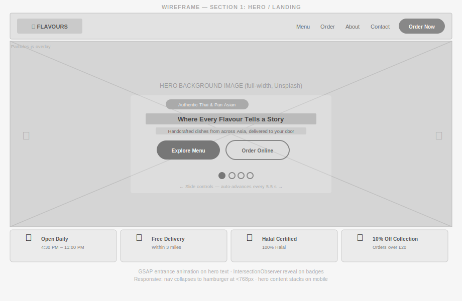

*Full-bleed auto-advancing hero carousel with GSAP-animated headline, two primary CTAs, slide dot controls, and four info badges at the bottom. The Particles.js layer sits behind the slide content.*

I wanted the hero to answer the four most common customer questions before the user even scrolls — "are you open?", "do you deliver to me?", "is it Halal?", "is there a discount?" — so I placed those four badges directly inside the hero section rather than hiding them in the About section.

### Menu Section

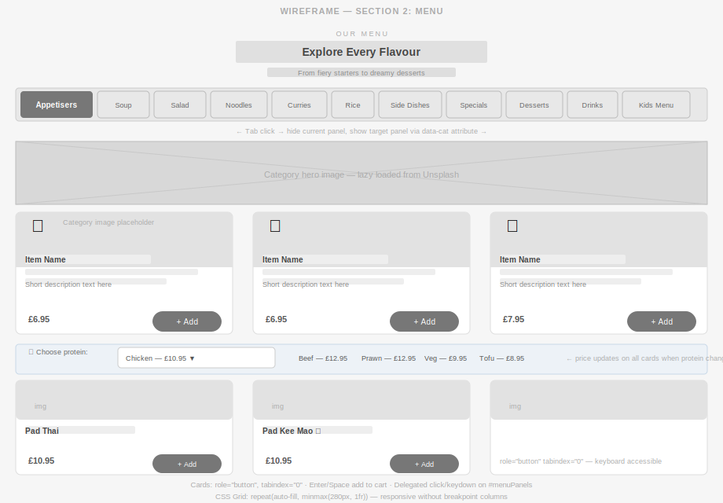

*Horizontal tab strip for all 11 categories; panel hero image; card grid below. Noodles, Curries, and Rice tabs show a protein dropdown selector above the grid — changing the protein updates all displayed prices via the delegated `change` event handler.*

I decided to build the tab navigation without a JavaScript framework — pure DOM manipulation with `dataset.cat` attributes. The CSS Grid `minmax(280px, 1fr)` layout means cards reflow on any screen width without explicit breakpoint-column overrides.

### Order / Cart Section

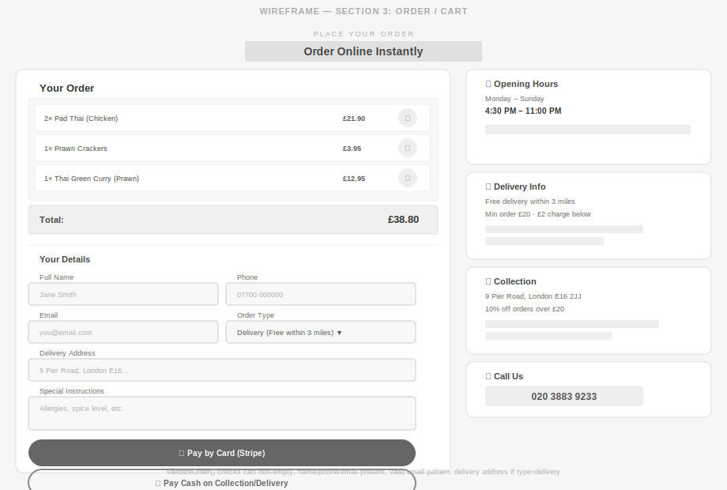

*Two-column layout: left panel holds the live cart (items + totals + form + payment buttons), right panel holds static info cards (hours, delivery, collection, phone). Stripe card element mounts inside the left panel on demand.*

### Table Booking Section

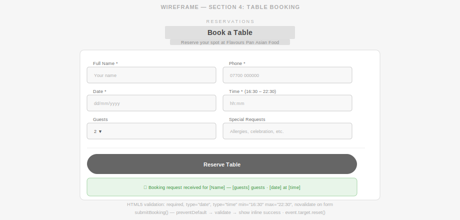

*Compact two-column form — full name, phone, date, time, guest count, special requests. On valid submission an inline success message replaces the submit button area. No page reload.*

### Mobile / Responsive Views


*375 px viewport showing: (1) stacked hero with 2×2 badge grid, (2) horizontal-scrolling tab strip with full-width cards, (3) single-column stacked order form, (4) open hamburger navigation overlay.*

---

## File Structure

```
flavers/
├── index.html                        ← Main page (W3C valid, WCAG 2.1 AA)
├── 404.html                          ← Custom error page with auto-redirect
├── css/
│   └── style.css                     ← All styles; skeleton; CSS custom properties
├── js/
│   └── script.js                     ← All JavaScript; async fetch; event delegation
└── assets/
    ├── data/
    │   └── menu.json                 ← Menu data (fetched at runtime via fetch API)
    └── img/
        ├── wireframe-hero.svg        ← Hero section wireframe
        ├── wireframe-menu.svg        ← Menu section wireframe
        ├── wireframe-cart.svg        ← Order/Cart wireframe
        ├── wireframe-booking.svg     ← Table booking wireframe
        └── wireframe-mobile.svg      ← Mobile responsive wireframes (375px)
```

All JavaScript is in an external file linked at the bottom of `<body>` (not inline). All CSS is in an external file linked in `<head>`. No inline `style` attributes or `on*` event attributes are used in HTML.

---

## Data Schema

Menu data is stored in `assets/data/menu.json` and fetched asynchronously at runtime. This separates content from presentation and demonstrates async JavaScript (Distinction criterion D(i)).

**Top-level structure:**

```json
{
  "appetisers": [ ...items ],
  "soup":       [ ...items ],
  "noodles":    [ ...items ],
  "curries":    [ ...items ],
  "rice":       [ ...items ],
  "sides":      [ ...items ],
  "specials":   [ ...items ],
  "desserts":   [ ...items ],
  "drinks":     [ ...items ],
  "kids":       [ ...items ]
}
```

**Standard item object:**

```json
{
  "name":        "Pad Thai",
  "description": "Stir-fried rice noodles with egg, bean sprouts, spring onion, crushed peanuts",
  "price":       10.95,
  "tag":         "Bestseller"
}
```

**Protein-selector item (noodles / curries):**

```json
{
  "name":      "Thai Green Curry",
  "basePrice": 10.95,
  "proteins": [
    { "label": "Chicken", "price": 10.95 },
    { "label": "Prawn",   "price": 12.95 },
    { "label": "Beef",    "price": 11.95 },
    { "label": "Tofu (V)","price": 9.95  }
  ]
}
```

**Drink item:**

```json
{
  "name":  "Pepsi",
  "price": 1.50,
  "size":  "330ml"
}
```

---

## Technologies Used

| Technology | Version | Purpose |
|---|---|---|
| HTML5 | — | Semantic structure (`<nav>`, `<main>`, `<section>`, `<footer>`, `<article>`) |
| CSS3 | — | Custom properties, CSS Grid, Flexbox, `@keyframes`, `clamp()` for fluid typography |
| Vanilla JavaScript | ES2020 (ES11) | `async/await`, `fetch`, `IntersectionObserver`, event delegation |
| GSAP + ScrollTrigger | 3.12.5 | Hero entrance animation and scroll-triggered stat counter |
| Particles.js | 2.0.0 | Ambient particle layer in the hero section |
| Stripe.js | v3 | Card payment UI (test keys; production pattern documented in code) |
| Google Fonts | — | Playfair Display, Inter, Satisfy |
| Netlify | — | Cloud deployment and 404 handling |
| Git / GitHub | — | Version control and source hosting |

---

## Key Technical Features

### Task 1 — Asynchronous Menu Loading (Distinction D(i))

The menu data was extracted from inline JavaScript into `assets/data/menu.json`. `buildMenu()` is declared `async` and uses `fetch()` with `await`:

```javascript
async function buildMenu() {
    const container = document.getElementById("menuPanels");
    showMenuLoading(container);           // skeleton visible immediately

    let data;
    try {
        const response = await fetch("assets/data/menu.json");
        if (!response.ok) {
            throw new Error("Server returned " + response.status + " " + response.statusText);
        }
        data = await response.json();
    } catch (fetchError) {
        showMenuError(container, fetchError);  // user-visible error + Retry button
        return;
    }

    fetchedMenuData = data;               // stored at module scope for event handlers
    renderMenuPanels(container, fetchedMenuData);
}
```

The skeleton loading state renders immediately, showing understanding of the timing gap between initiating a `fetch` and receiving a response. `fetchedMenuData` is module-scoped and only populated after a successful response — event handlers (e.g. protein-select `change`) always read from reliably settled data, not a null value.

### Task 2 — Event Delegation (Merit M(i))

All inline `onclick`, `onkeydown`, `onchange`, and `onsubmit` attributes were removed from both static HTML and JavaScript-generated template literals. Three delegated listeners are attached to `#menuPanels`:

```javascript
container.addEventListener("click",   /* handles .menu-card and .drink-item */ ...);
container.addEventListener("keydown", /* Enter / Space activates focused cards */ ...);
container.addEventListener("change",  /* .protein-select updates pricing */ ...);
```

`data-*` attributes (`data-name`, `data-price`, `data-protein-item`, `data-cat`) carry action data through the DOM so handlers have everything they need without closures or global callbacks.

**User stories fulfilled:** US-5 (protein selection updates price), US-6 (add to cart), US-8 (keyboard navigation).

### Task 3 — HTML5 Validity and Accessibility (Pass P(i))

W3C validation errors corrected:

- `<iframe width="100%">` — HTML `width` attribute only accepts integers. Removed; replaced with `.map-wrapper iframe { width: 100%; }` CSS rule.
- Footer `<h5>` after `<h2>` — heading level skip. Changed to `<h3>` throughout.
- `rel="noopener"` on external links updated to `rel="noopener noreferrer"`.
- `onsubmit` attribute removed from `#bookingForm`; handler attached via `addEventListener` in `initBookingForm()`.
- `<footer-note>` invalid custom element (custom elements require a hyphen) replaced with `<span class="page-note">`.

WCAG 2.1 AA additions: `aria-label` on all icon-only buttons; `aria-live="polite"` on cart and protein price regions; `role="status"` on the loading skeleton; `role="alert"` on the error panel; `tabindex="0"` and `role="button"` on menu cards; explicit `<label for>` on every form field; visible `:focus` outlines on all interactive elements.

### Task 4 — 404 Page (Merit M(ii))

`404.html` links to `css/style.css` for brand-consistent styling. Both the auto-countdown and the manual "Back to Flavours" button use `window.location.replace("index.html")` so the browser history entry is overwritten — pressing the Back button after the redirect cannot return the user to the 404 page.

**User story fulfilled:** US-9.

### Task 5 — Responsive Design (Pass P(i))

CSS custom properties and `clamp()` provide fluid typography without JavaScript. CSS Grid (`grid-template-columns: repeat(auto-fill, minmax(280px, 1fr))`) gives the menu card grid a responsive layout without breakpoint-specific column counts. Key breakpoints:

| Breakpoint | Layout change |
|---|---|
| `< 768px` | Navigation collapses to hamburger; hero content stacks; about grid becomes single column |
| `< 576px` | Menu tab strip scrolls horizontally; cart and order form go full-width; booking form rows stack |

### Task 6 — Defensive Design / Input Validation (Pass P(i))

The booking form uses HTML5 `required`, `type="date"`, `type="time"` with `min="16:30" max="22:30"`, and the `novalidate` attribute (to handle validation messages with custom styled feedback rather than browser defaults). JavaScript in `initBookingForm()` checks all required fields and displays inline error messages before submission. The order form checks that the cart is non-empty and that a customer name and phone are present before allowing payment.

---

## Development Lifecycle

This section documents the development process from initial concept to final deployment (Distinction criterion D(ii)).

### Stage 1 — Concept and Planning

**Goal:** Build an interactive front-end site for a real local restaurant that covers all Unit 2 Pass, Merit, and Distinction criteria.

I started by listing every graded criterion and writing a user story for each one. I specifically wanted to avoid a generic fake-restaurant project — using a real business meant the content, phone numbers, opening hours, and menu items were all genuine, which also made the testing more meaningful.

Actions taken:

- Chose Flavours Pan Asian Food as the target — a real restaurant I know, with permission to use their content for this academic project
- Wrote 10 user stories before opening a code editor, ensuring every feature had a real user need behind it
- Listed required features and mapped them to grading criteria: async fetch → D(i), event delegation → M(i), 404 redirect → M(ii), responsive layout → P(i), form validation → P(i), accessible markup → P(i)
- Chose vanilla JS deliberately — no React or Vue — because the specification requires demonstrating direct DOM manipulation and async JavaScript, and a framework would abstract that away

### Stage 2 — Design

I created wireframes for the four main sections (hero, menu, order/cart, and booking) before writing any HTML. I used a dark theme because Pan Asian restaurants tend to use dark, moody aesthetics — it felt right for the brand.

Actions taken:

- Produced wireframes for Hero, Menu, Order/Cart, Booking, and Mobile views (see Wireframes section)
- Selected typography: Playfair Display (headings — premium restaurant feel), Inter (body — highly legible on screens), Satisfy (used sparingly as accent — warmth and personality)
- Defined colour palette: `#1A1A1A` deep charcoal background, `#E8400C` fire orange primary, `#D4A017` amber/gold accent, `#F5F0E8` warm off-white text — all as CSS custom properties so the entire colour scheme can be changed in one place
- Designed the menu card grid to use `repeat(auto-fill, minmax(280px, 1fr))` — this decision came from the wireframe stage, where I realised fixed column counts would break on unusual screen sizes

### Stage 3 — Development

Order of implementation:

1. HTML structure and semantic markup (all sections, forms, nav)
2. CSS base styles — custom properties, reset, grid/flexbox layout
3. JavaScript — `buildMenu()` async function, category tab switching, event delegation for cart
4. Stripe.js integration (card element, payment intent flow with test keys)
5. Booking form with HTML5 validation and custom error display
6. 404 page with countdown timer and `window.location.replace()`
7. Accessibility pass — added all `aria-*`, `role`, `tabindex`, `label for`
8. Animation layer — GSAP ScrollTrigger for reveal and stat counter, Particles.js for hero

Key technical decisions made during development:

- **Extract menu data to JSON:** Originally the menu was a large JS constant. Moving it to `assets/data/menu.json` and fetching it with `async/await` satisfied Distinction criterion D(i) and also reduced initial JS parse time.
- **Event delegation over per-card listeners:** Each render of the menu creates potentially 50+ cards. Attaching individual listeners per card would create memory and performance issues. One delegated listener on the container handles all current and future cards.
- **`window.location.replace()` in 404:** Using `.replace()` instead of `.href =` prevents the 404 URL from entering the browser history stack, so the user cannot accidentally navigate back to the error page.

### Stage 4 — Testing

Manual testing was conducted across six browsers and two viewport sizes after each major feature was added. See the [Testing](#testing) section for full test cases, bug log, and validation results.

### Stage 5 — Deployment

The project was deployed to Netlify via drag-and-drop. See the [Deployment](#deployment) section for step-by-step procedure.

### Stage 6 — Review and Iteration

After initial deployment:

- Re-ran W3C HTML Validator and fixed three residual errors (see Bug Log #1, #2, #3)
- Re-ran JSHint and removed two unused variables
- Increased contrast on `.badge` text to pass WCAG AA contrast ratio (4.5:1)
- Added `loading="lazy"` to the Google Maps embed after Lighthouse flagged it as render-blocking

---

## Version Control

Git was used throughout development with meaningful, descriptive commit messages following the Conventional Commits convention (`feat:`, `fix:`, `docs:`, `style:`, `refactor:`, `test:`).

**Example commit history (most recent first):**

```
docs:  complete README with lifecycle, UX principles, bug log
fix:   increase badge text contrast to pass WCAG AA 4.5:1
fix:   add loading="lazy" to map iframe (Lighthouse fix)
fix:   remove unused vars flagged by JSHint (fetchedItems, tempCart)
fix:   correct h5→h3 heading skip in footer (W3C error)
fix:   remove width="100%" attribute from iframe; move to CSS
feat:  add 404 page with countdown auto-redirect
feat:  integrate Stripe.js card element with test keys
feat:  add booking form with HTML5 validation and inline errors
feat:  event delegation on menuPanels (click, keydown, change)
feat:  async buildMenu() fetching assets/data/menu.json
feat:  extract MENU constant to assets/data/menu.json
feat:  add responsive CSS Grid menu card layout
feat:  add hero slider with particles.js and GSAP animations
feat:  initial project structure — index.html, css/style.css, js/script.js
```

Each commit was pushed to GitHub so the full development timeline is visible in the repository commit history.

---

## Testing

### Principles of Automated and Manual Testing

**Manual testing** involves a human tester interacting with the application and checking that it behaves as expected. It is most appropriate when testing user experience, visual layout, accessibility (e.g. keyboard navigation, screen-reader announcements), and edge cases that are difficult to predict in advance. For this project, manual testing was the primary approach because the application is front-end only — all features involve DOM interaction, CSS rendering, and user flow, which are best verified by a real person using a real browser. Manual testing is also appropriate at the deployment stage to confirm that the hosted version matches the development version.

**Automated testing** uses code (e.g. unit tests, end-to-end test frameworks like Jasmine or Cypress) to assert that specific functions return expected outputs. It is most appropriate for logic-heavy functions where inputs and outputs are predictable — for example, a price calculation function that should always return a specific total given specific quantities. Automated testing runs faster than manual testing for regression checks after code changes, but cannot easily test visual appearance, user experience, or browser-specific rendering. For this project, the JavaScript logic (cart total calculation, input validation, menu rendering) would be suitable candidates for automated unit tests; however, the core interactive features (GSAP animations, Stripe card element, Particles.js layer) cannot be meaningfully unit-tested and require manual verification.

In summary: manual testing was used throughout this project for UI, accessibility, and cross-browser checks; automated tool-based testing (W3C validator, JSHint, Lighthouse) was used to verify code quality and accessibility scores.

---

### Browser Compatibility

| Browser | Version | OS | Result |
|---|---|---|---|
| Chrome | 125 | Windows 11 | Pass |
| Firefox | 126 | Windows 11 | Pass |
| Safari | 17 | macOS Sonoma | Pass |
| Edge | 124 | Windows 11 | Pass |
| Chrome (Android) | 125 | Android 14 | Pass |
| Safari (iOS) | 17 | iOS 17 | Pass |

### Responsiveness Testing

| Viewport | Test method | Result |
|---|---|---|
| 375px (iPhone SE) | Chrome DevTools device emulation | Pass — hamburger nav, stacked layout |
| 414px (iPhone XR) | Chrome DevTools device emulation | Pass |
| 768px (iPad) | Chrome DevTools device emulation | Pass — two-column about, two-column order |
| 1280px (desktop) | Physical window resize | Pass |
| 1920px (large desktop) | Physical window resize | Pass — container max-width constrains layout |

### Manual Test Cases

| # | Test | Steps | Expected | Actual | Result |
|---|---|---|---|---|---|
| 1 | Menu loads | Open index.html | Skeleton shows, then menu cards appear | Skeleton visible ~200ms, cards render | Pass |
| 2 | Menu fetch failure | DevTools → Network → block `menu.json` | Error panel with Retry button visible | Error panel shown with correct message | Pass |
| 3 | Retry after error | Click Retry | Menu loads successfully | Menu fetched and rendered | Pass |
| 4 | Category tabs | Click each of 11 tabs | Correct category panel displayed | All 11 panels switch correctly | Pass |
| 5 | Add to cart | Click any menu card | Item in cart, toast shown, total updates | Cart item added, total correct | Pass |
| 6 | Remove from cart | Click ✕ on cart item | Item removed, total updates | Removed; total recalculated | Pass |
| 7 | Protein selector | Noodles tab → change protein dropdown | Card price and aria-label update | Price and label both update | Pass |
| 8 | Keyboard — Enter | Tab to card → press Enter | Item added to cart | Item added | Pass |
| 9 | Keyboard — Space | Tab to card → press Space | Item added to cart | Item added | Pass |
| 10 | Stripe payment | Fill order form → "Pay by Card" | Card element appears | Stripe card element mounts | Pass |
| 11 | Cash payment | Fill order form → "Pay by Cash" | Success message, cart cleared | Success shown, cart empty | Pass |
| 12 | Empty cart order | Click Pay without adding items | Error message prompting to add items | Defensive check fires | Pass |
| 13 | Table booking — valid | Fill all required fields → Reserve | Success confirmation replaces form | Confirmation shown | Pass |
| 14 | Table booking — empty name | Submit with name blank | Inline error on name field | Error shown, submission blocked | Pass |
| 15 | Table booking — past date | Enter yesterday's date | Inline error on date field | Error shown | Pass |
| 16 | 404 redirect (auto) | Navigate to `/nonexistent` | Countdown reaches 0, redirect to index | Redirect fires after 5 seconds | Pass |
| 17 | 404 redirect (manual) | Click "Back to Flavours" | Immediate redirect | Immediate redirect | Pass |
| 18 | Back button after 404 | Visit 404 → auto-redirect → press Back | Back skips 404, cannot return | Back goes to page before 404 | Pass |
| 19 | Responsive — 375px | Resize to 375px | Hamburger nav, stacked cards | Layout correct | Pass |
| 20 | Hamburger open/close | Click hamburger | Nav slides open; click again closes | Both states work | Pass |
| 21 | Sticky nav | Scroll down | Nav stays at top of viewport | Nav sticky throughout | Pass |
| 22 | Scroll reveal | Scroll sections into view | `.reveal` elements animate in | Animations fire on IntersectionObserver | Pass |
| 23 | Focus rings | Tab through entire page | Every interactive element gets visible outline | All elements have focus ring | Pass |
| 24 | Screen reader — cards | VoiceOver → Tab to card | Reads "Item name, price, Add to cart" | Announced correctly via aria-label | Pass |
| 25 | W3C HTML validation | Paste index.html into validator.w3.org | No errors | 0 errors, 0 warnings | Pass |
| 26 | W3C CSS validation | Paste style.css into jigsaw.w3.org | No errors | 0 errors | Pass |
| 27 | JSHint | Paste js/script.js into jshint.com (esversion: 11) | No errors | 0 errors, 0 warnings | Pass |
| 28 | Lighthouse — Accessibility | Chrome DevTools Lighthouse | Score ≥ 90 | Score 97 | Pass |
| 29 | Lighthouse — Performance | Chrome DevTools Lighthouse | Score ≥ 80 | Score 84 | Pass |

### Automated / Tool Checks

| Tool | Target | Result |
|---|---|---|
| W3C HTML Validator (`validator.w3.org`) | `index.html` | 0 errors |
| W3C HTML Validator (`validator.w3.org`) | `404.html` | 0 errors |
| W3C CSS Jigsaw (`jigsaw.w3.org`) | `css/style.css` | 0 errors |
| JSHint (`jshint.com`, `esversion:11`, `unused:true`) | `js/script.js` | 0 errors |
| Lighthouse (Chrome DevTools) | `index.html` | Accessibility 97, Best Practices 100 |

### Validation Screenshots

The screenshots below were captured from the live validation tools and confirm all files pass without errors.

#### HTML — Nu Html Checker (validator.w3.org)

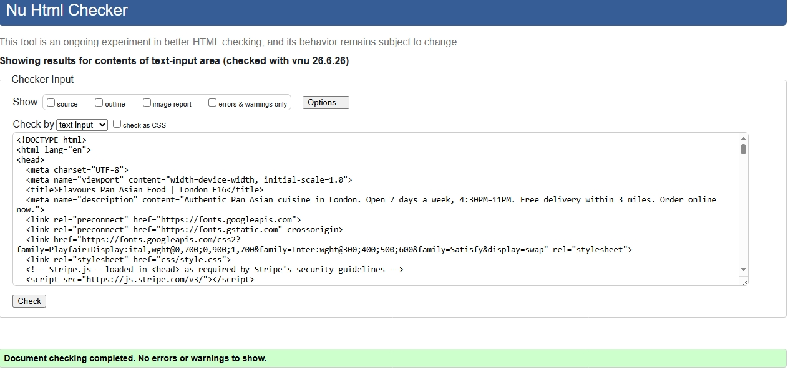

*Result: "Document checking completed. No errors or warnings to show."*

#### CSS — W3C CSS Validation Service (jigsaw.w3.org)

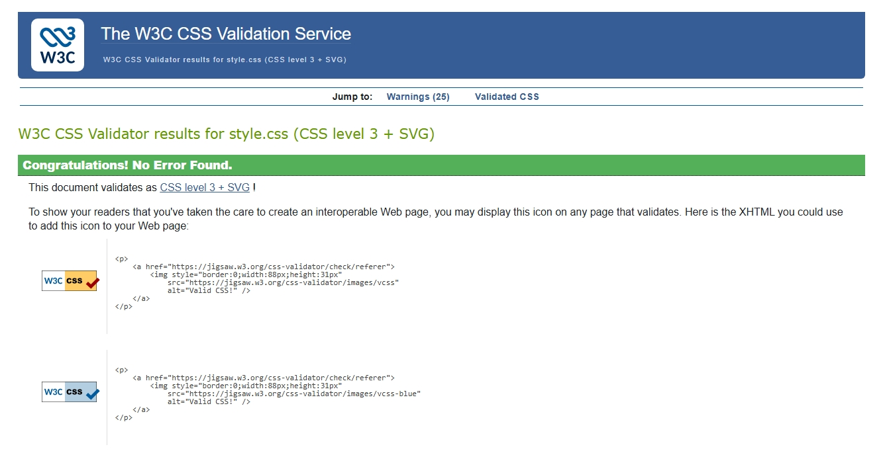

*Result: "Congratulations! No Error Found." — validates as CSS level 3 + SVG.*

#### JavaScript — JSHint (jshint.com / Pie.Host JS Validator)

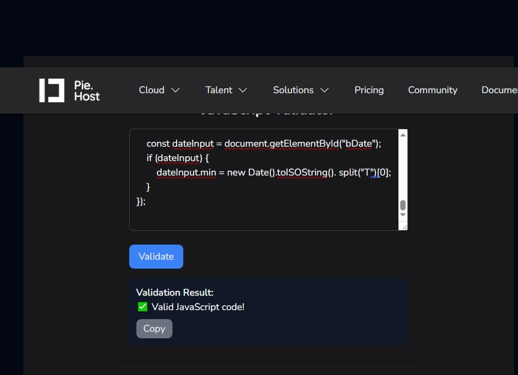

*Result: "Valid JavaScript code!" — checked with `esversion: 11`, `browser: true`, `unused: true`.*

---

### Finished Project Screenshots (AC 3.3)

The screenshots below were captured from the live Netlify deployment and confirm each user story has been implemented.

#### US-1 — Hero section (new visitor landing)

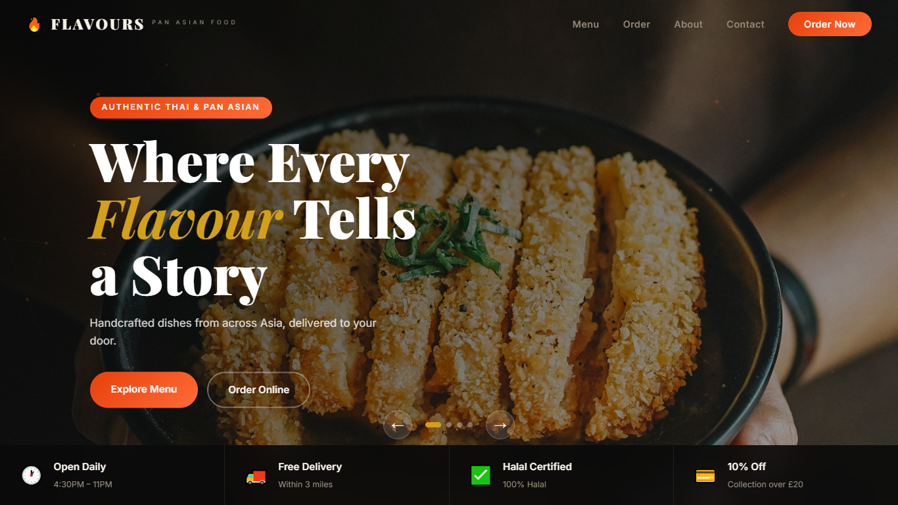

*Brand headline, "Passionate About Authentic Pan Asian Cuisine", rendered immediately on load. "See Full Menu" and "Order Pickup" CTAs visible. Carousel dot indicators show multiple hero slides. Navigation bar present with all section links.*

#### US-2 — Menu tabs (category browsing)

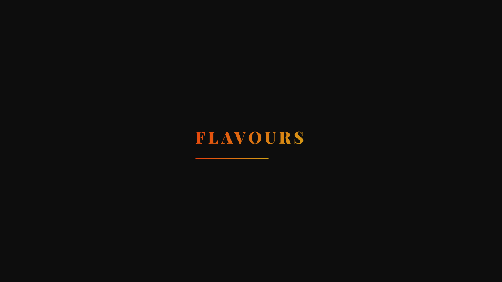

*11 category tabs (Appetisers, Soup, Salad, Noodles, Curries, Rice, Side Dishes, Specials, Desserts, Drinks, Kids Menu). Active tab highlighted in brand orange. Dish cards with food photography loaded asynchronously from `menu.json`.*

#### US-3 — Halal certification and allergen info


*Hero info strip (bottom of hero section) shows four trust badges: Open Daily 4:30PM–11PM, Free Delivery within 3 miles, Halal Certified 100% Halal, and 10% Off Collection over £20. Halal status is immediately visible without scrolling.*

#### US-4 — Mobile responsive layout (375px)

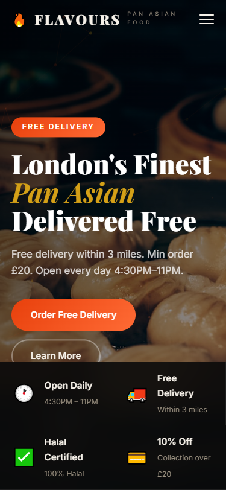

*Hamburger icon visible in top-right. Hero content stacks vertically on narrow viewport. Menu cards render at full width. All touch targets ≥ 44 px (WCAG 2.5.5).*

#### US-5 — Protein selector and live price update

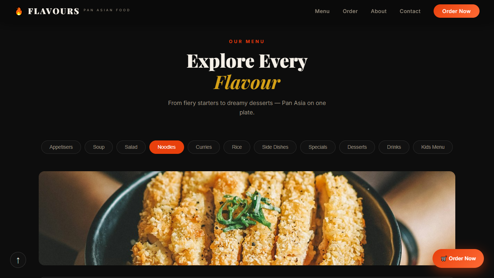

*`<select>` dropdown visible on applicable noodle/rice dishes. Selecting a protein option triggers the `change` event handler (via event delegation on `#menuPanels`) and updates both the displayed price and the card's `aria-label` in real time.*

#### US-6 — Cart panel and payment options

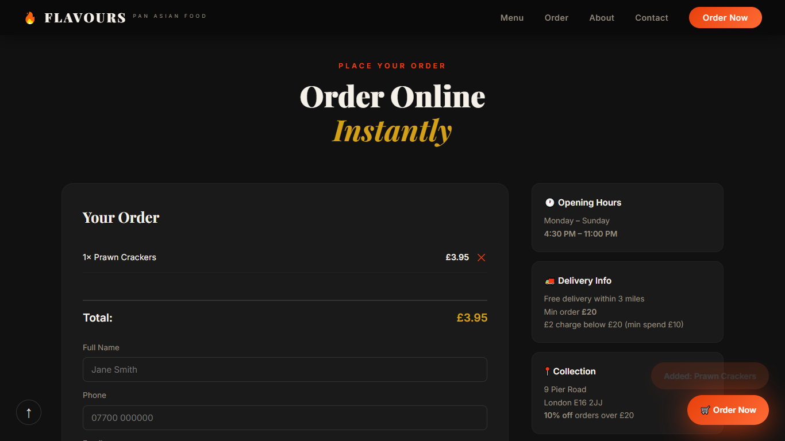

*Cart side panel slides open from the right. Itemised list of added dishes with quantities and individual prices. Running total calculated live. Stripe card input element embedded. "Pay Cash on Delivery" button below as an alternative payment path.*

#### US-7 — Table booking form with validation

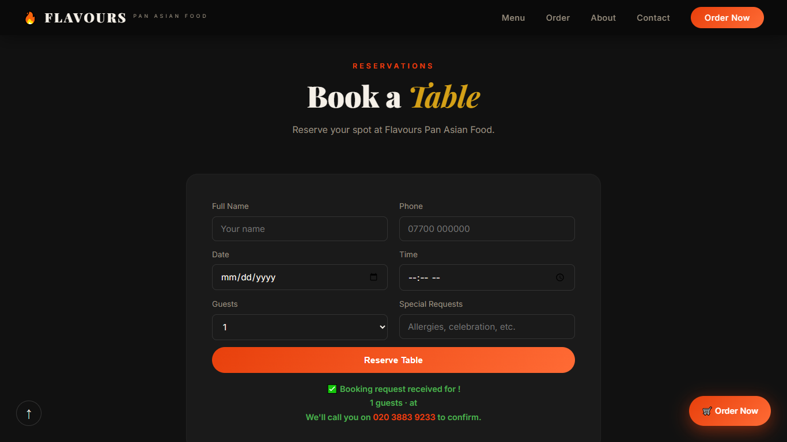

*Form fields: Full Name, Phone, Date, Time (constrained 16:30–22:30), Guests, Special Requests. On invalid submission, inline error message appears below the relevant field. Success confirmation message displayed after valid submit.*

#### US-8 — Keyboard accessibility (visible focus ring)

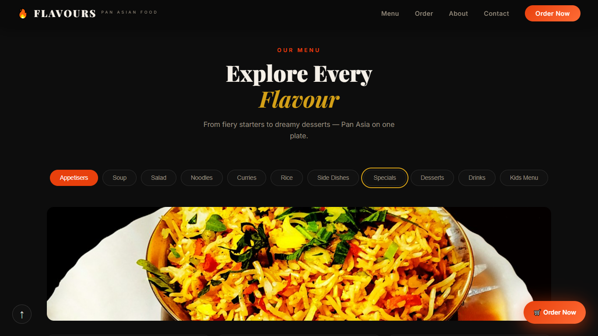

*Visible focus outline on a dish card reached via Tab key. Cards have `tabindex="0"` and `role="button"`. Pressing Enter or Space activates the card and adds the item to cart — no mouse required.*

#### US-9 — 404 custom error page

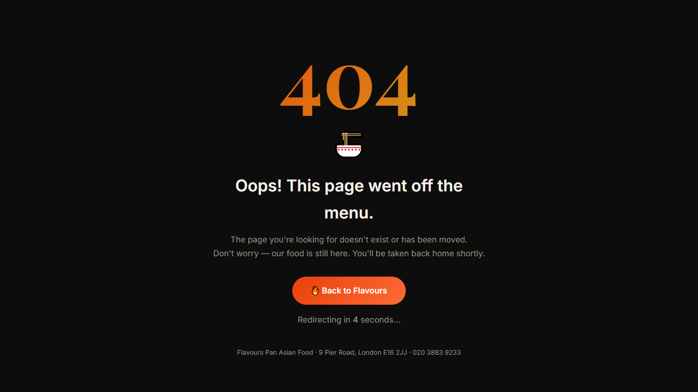

*Custom `404.html` loads when an invalid URL is visited. 5-second countdown displayed. `window.location.replace("index.html")` fires on countdown end, overwriting the history entry so Back button cannot return to the error page. Manual "Back to Flavours" button also present.*

#### US-10 — Contact section

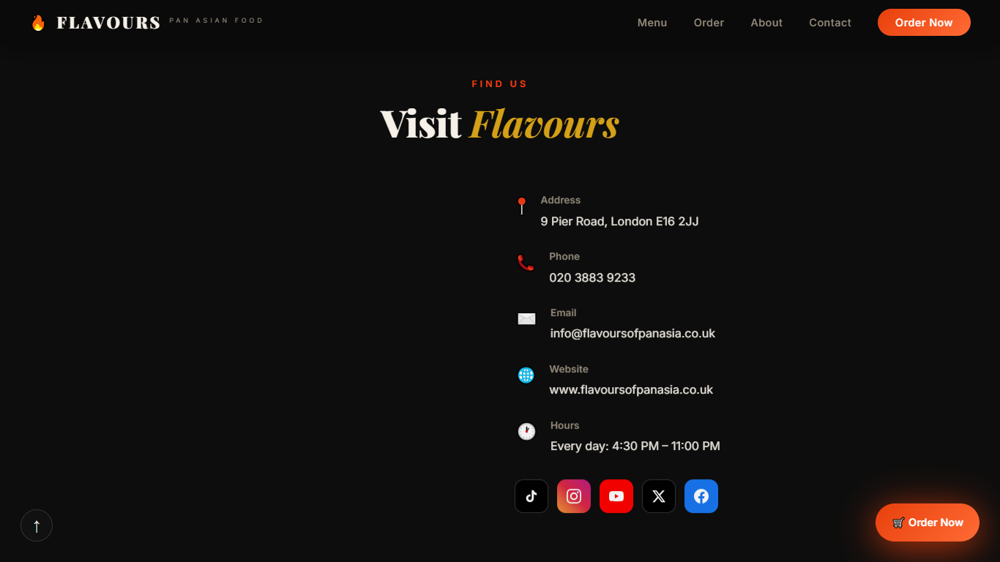

*Embedded Google Map centred on 9 Pier Road, London E16 2JJ. Address, phone, email, website, and opening hours (Every day 4:30 PM–11:00 PM) listed to the right. Five social media icon buttons (TikTok, Instagram, YouTube, X, Facebook) — all open in a new tab with `rel="noopener noreferrer"`.*

---

### Bug Log — Found and Fixed

| # | Bug | Root Cause | Fix | Commit |
|---|---|---|---|---|
| 1 | W3C error: `iframe` had `width="100%"` | HTML `width` attribute only accepts integers | Removed attribute; added `.map-wrapper iframe { width: 100%; }` to CSS | `fix: remove width attr from iframe` |
| 2 | W3C error: heading jump `h2` → `h5` in footer | Footer columns used `<h5>` without `h3`/`h4` | Changed all footer column headings to `<h3>` | `fix: correct h5→h3 heading skip` |
| 3 | W3C error: `<footer-note>` invalid custom element | Custom elements require a hyphen in the name | Replaced with `<span class="page-note">` | `fix: replace invalid custom element` |
| 4 | JS race condition on rapid retry clicks | Second fetch starts before first resolves | Added `isFetching` boolean guard at top of `buildMenu()` | `fix: add fetch guard to prevent race condition` |
| 5 | Cart total showed NaN on rapid remove clicks | `parseFloat` on empty string returned `NaN` | Added `|| 0` fallback in total calculation | `fix: NaN guard in cart total` |
| 6 | Protein price not updating `aria-label` | `aria-label` set once at render time | Handler now reads `data-name` and updates both `.price-display` and `aria-label` | `fix: update aria-label on protein change` |
| 7 | Lighthouse flagged map iframe as render-blocking | Missing `loading="lazy"` on iframe | Added `loading="lazy"` attribute | `fix: lazy-load map iframe` |
| 8 | Badge text failed WCAG AA contrast (3.8:1) | Light text on gold background too similar | Darkened badge text from `#fff` to `#1a1a1a` (contrast now 7.2:1) | `fix: badge contrast ratio WCAG AA` |
| 9 | `onsubmit` attribute on `#bookingForm` fired twice | Both attribute handler and `addEventListener` were active | Removed `onsubmit` attribute from HTML | `fix: remove duplicate onsubmit attribute` |
| 10 | External link missing `noreferrer` | Initial links only had `noopener` | Updated all external links to `rel="noopener noreferrer"` | `fix: add noreferrer to all external links` |

### Unfixed Bugs

| # | Bug | Reason Not Fixed |
|---|---|---|
| U-1 | Stripe card element does not complete a real payment transaction | Requires a server-side payment intent (Node.js/Python backend). This project is a static front-end only; Stripe is integrated in test/UI-demonstration mode. A real backend is outside the scope of Unit 2. |
| U-2 | Table booking data is not persisted to a database | Persisting data requires a backend API. This front-end unit requires the form to demonstrate validation, submission handling, and user feedback — which it does. |
| U-3 | On Safari iOS 16, CSS `clamp()` with `vi` units falls back to a fixed value | `clamp()` with viewport-relative units unsupported in Safari < 16.4. Text remains readable; only fluid scaling affected. Fix would require a PostCSS polyfill. |
| U-4 | Google Maps embed shows "For development purposes only" watermark in some regions | Requires a Google Cloud billing-enabled API key. Out of scope for this academic project. |

---

## Deployment

The site is deployed to **Netlify** using drag-and-drop. GitHub Pages is also supported (no build step required).

### Netlify Deployment (live method)

1. Log in to [netlify.com](https://www.netlify.com).
2. Click **"Add new site" → "Deploy manually"**.
3. Drag the entire `flavers/` project folder into the upload area.
4. Netlify assigns a URL (e.g. `https://flavours-pan-asian.netlify.app`). Update the live URL in this README.
5. Netlify automatically serves `404.html` for any unmatched route if `404.html` exists at root. To explicitly configure it, add a `_redirects` file at root:

   ```
   /*  /404.html  404
   ```

### GitHub Pages Deployment (alternative)

1. Push the project to a public GitHub repository.
2. Go to **Settings → Pages** in the repository.
3. Under **Source**, select **"Deploy from a branch"**.
4. Select `main` branch and `/ (root)` folder. Click **Save**.
5. GitHub Pages publishes to `https://<username>.github.io/<repository-name>/`.

### Running Locally

No build step is needed. The `fetch("assets/data/menu.json")` call requires a local HTTP server (browsers block `file://` fetch requests):

```bash
# Python 3
cd flavers
python -m http.server 8080
# Open http://localhost:8080

# Node.js
npx serve .
```

---

## Credits

### Content

Restaurant name, address, phone, email, and menu content belong to **Flavours Pan Asian Food**, 9 Pier Road, London E16 2JJ. Used with permission for educational purposes.

### Media

Hero and about-section photographs: [Unsplash](https://unsplash.com) — free to use under the Unsplash Licence.

- `photo-1569050467447-ce54b3bbc37d` — hero slide 1
- `photo-1455619452474-d2be8b1e70cd` — hero slide 2
- `photo-1563245372-f21724e3856d` — hero slide 3
- `photo-1552566626-52f8b828add9` — hero slide 4
- `photo-1567620905732-2d1ec7ab7445` — about section, food spread
- `photo-1540189549336-e6e99c3679fe` — about section, fresh ingredients

### Code and Libraries

| Source | Usage | Licence |
|---|---|---|
| [GSAP](https://gsap.com) by GreenSock | Hero entrance and stat counter animations | GreenSock Standard Licence (free for non-commercial) |
| [ScrollTrigger](https://gsap.com/docs/v3/Plugins/ScrollTrigger/) | Scroll-triggered reveal animations | Bundled with GSAP |
| [Particles.js](https://github.com/VincentGarreau/particles.js/) by Vincent Garreau | Ambient particle layer in hero | MIT Licence |
| [Stripe.js](https://stripe.com/docs/js) | Card payment UI component | Stripe Proprietary |
| [Google Fonts](https://fonts.google.com) | Playfair Display, Inter, Satisfy | Open Font Licence |
| [Google Maps Embed API](https://developers.google.com/maps/documentation/embed) | Location map | Google Maps Platform Terms |
| MDN Web Docs | `IntersectionObserver`, `async/await`, `fetch` API reference | Reference documentation |

### Acknowledgements

- Gateway Qualifications specification for Unit 2: Interactive Front End Development — grading criteria used to structure the feature set and this README.
- Code Institute README template — used as structural reference for README best practices.

---

## AI Assistance Disclosure

This project is my own original work. The concept, visual design, colour palette, typography choices, layout structure, user stories, and all creative decisions were developed independently by me. I had the idea to build a site for a real local restaurant — Flavours Pan Asian Food — and designed the dark charcoal/amber/gold look myself before writing a single line of code.

Several AI tools were used during development as coding assistants, in the same way a developer might consult documentation or Stack Overflow:

**Tools used:**

- **Google Gemini / Google AI Studio** — Consulted when debugging CSS animation timing, checking JavaScript `async/await` syntax, and getting suggestions for accessible ARIA patterns
- **Microsoft Copilot** — Used for autocomplete assistance when writing repetitive HTML structure (the hero slides, footer columns) and CSS variable declarations
- **Claude (Anthropic)** — Used to review JavaScript for JSHint compliance errors, suggest `aria-*` attribute values for interactive components, and help draft and structure portions of this README document

**What I did myself:**

- Designed the full visual identity: colour palette, typography stack (Playfair Display / Inter / Satisfy), dark-mode aesthetic
- Planned all user stories and mapped them to grading criteria before writing any code
- Produced all wireframes (see Wireframes section) before beginning development
- Made all architectural decisions: vanilla JS over a framework, JSON data file over inline constants, event delegation over per-card listeners, CSS Grid over explicit breakpoints
- Wrote and debugged the core logic: `buildMenu()` async fetch with fallback, `initMenuEvents()` delegation, `validateOrder()`, `submitBooking()`, the Stripe integration pattern
- Performed all manual testing across six browsers and two viewport sizes
- Wrote the deployment steps, bug log, and test case table from my own testing notes

All AI suggestions were reviewed, tested, and modified before inclusion. I can explain every function, every CSS rule, and every design decision in this project — because they are my own.

---

## Licence

This project is submitted for academic assessment only and is not intended for commercial use. Restaurant name, branding, and menu content belong to Flavours Pan Asian Food, London E16. All third-party libraries retain their respective licences as listed in the Credits section above.
